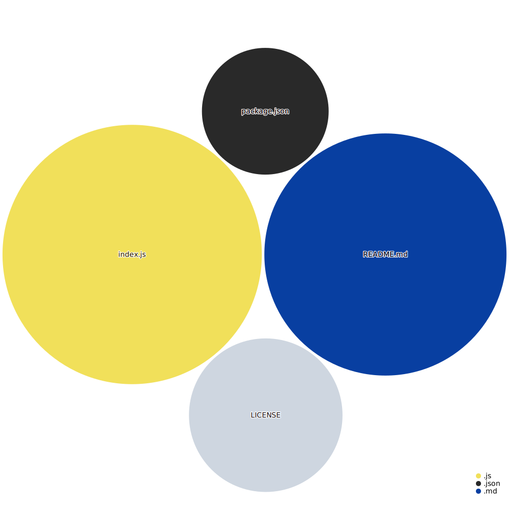

# hexo-console-webmention

**Sending Webmentions for posts within Hexo**

This [console command for Hexo](https://hexo.io/api/console.html) utilizes the work of [Remy Sharp](https://remysharp.com/2019/06/18/send-outgoing-webmentions), who wrote a JS library to parse a URL for sending Webmentions to linked Blogs. It is mainly used at [**webmention.app**](https://webmention.app/), but has its source code here ([https://github.com/remy/wm](https://github.com/remy/wm)) and its NPM package here ([https://www.npmjs.com/package/@remy/webmention](https://www.npmjs.com/package/@remy/webmention)).

## Installation

``npm install hexo-console-webmention --save``

## Usage

### Parameter

3 options are available:

**--slug** <string>: Parse a particular post by its filename (slug)

**--count** <int>: Parse a number of latest posts (not considered when *--slug* is used)>; default = 1

**--send** <bool>: Parse and send Webmentions (without, only the endpoints found are displayed) 

### Examples

Parse and show endpoints for the latest post:

```
hexo webmention
```

Parse and show endpoints for the latest 20 posts:

```
hexo webmention --count 20
```

Parse and **send** Webmentions for the latest post:

```
hexo webmention --send true
```

Parse and **send** Webmentions for the post "My Fancy Blogpost":

```
hexo webmention --slug my-fancy-blogpost --send true
```


## Contributing

Yes, please ... fork the project, make your changes and submit pull requests against the main branch.

## History
**1.0.0**
- Initial version

## License

**MIT** : http://opensource.org/licenses/MIT

## Codebase Vizualization
For an inactive diagram, please visit [Repo Visualization App](https://octo-repo-visualization.vercel.app/?repo=kristofzerbe%2Fhexo-console-webmention)...
